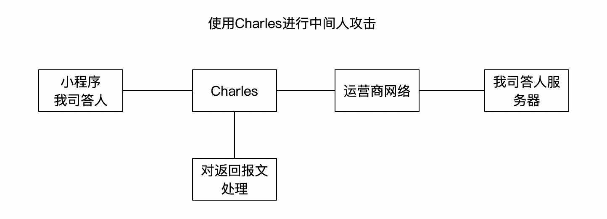
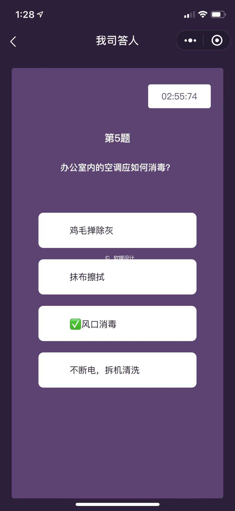

> 最近公司需要使用“我司答题”小程序，对武汉疫情进行知识问题；对榜单靠前的也有一定的学分奖励；虽然平时总不屑于公司组织的此类活动，但是看了这次活动形式，还是决定直接“爆破”

### 0x01 思路
> 18年大火的直播答题中，对某答题app也进行了类似爆破，并薅了不少羊毛，到了后期已经做到了全自动化的答题，并且是100%正确

正常情况下小程序和服务端通信流程

使用charles对请求进行串改流程


    因为我的主力电脑就是MacOS，所以就直接使用了Charles，当然Windows上也有很多类似软件，这里不再赘述。

### 0x02 开搞
  我先正常完成一轮答题，可以在Charles上看到小程序和服务端的每次通信报文，通过对请求接口分析，大致梳理出以下两个接口
	1. 开始测试&挑战接口：https://v4.21tb.com/race-mobile/mina/startRace.do
	2. 上传答案&获取下次题目接口：https://v4.21tb.com/race-mobile/mina/userAnswer.do

  对请求报文和返回报文分析后，确定报文的`data.examItem.itemOptions[].isCorrect`节点为正确答案。
```json
{
	"success": false,
	"data": {
		"examItem": {
			"itemOptions": [{
				"content": "疑似或确诊病例有过近距离接触",
				"isCorrect": true
			}, {
				"content": "感冒的病人",
				"isCorrect": false
			}],
			"itemName": "什么是新型冠状病毒密切接触者？"
		}
	},
	"message": null,
	"status": "SUCCESS"
}
```
只要搭建一个中间代理服务，在返回给小程序时把`content`字段进行修改，即可让我们快速在小程序上看到正确答案。
本次我使用的nodejs进行开发，我对nodejs语法海停留在新手上，将就看
```js
router.post('/21tb/:do', function (req, res, next) {
  console.log(req.params.do);
  fly.post('https://v4.21tb.com/race-mobile/mina/' + req.params.do + '.do', req.body, { headers: { "content-type": "application/x-www-form-urlencoded" } })
    .then(d => {
      console.log(d.data.data)
      if (d.data.data) {
        if (d.data.data instanceof Array) {
          for (var inx in d.data.data) {
            var data = d.data.data[inx];
            if (data.examItem && data.examItem.itemOptions) {
              var itemOptions = d.data.data.examItem.itemOptions;
              if (itemOptions) {
                for (var inx in itemOptions) {
                  var item = itemOptions[inx]
                  if (item.isCorrect) {
                    item.content = '✅' + item.content;
                  }
                }
              }
            }
          }
        } else {
          if (d.data.data.examItem && d.data.data.examItem.itemOptions) {
            var itemOptions = d.data.data.examItem.itemOptions;
            if (itemOptions) {
              for (var inx in itemOptions) {
                var item = itemOptions[inx]
                if (item.isCorrect) {
                  item.content = '✅' + item.content;
                }
              }
            }
          }
        }
      }
      res.send(d.data);
    })
    .catch(function (error) {
      console.log(error);
    });
});

```
再来看Charles上的配置，主要使用的`Map Remote`功能


通过这一系列的配置后，就可以实现对小程序请求的中间者攻击了

最终效果，正确答案上会有个“✅”：


### 0x03 引用&相关
1. [Charles Web Debugging Proxy](https://www.charlesproxy.com/)
2. [本文涉及的代码](https://github.com/xun404/21tb-auto-answer)